# TeqBook – System Architecture Diagram

Dette dokumentet viser systemarkitekturen til TeqBook med visuelle diagrammer.

---

## Høy-nivå Arkitektur

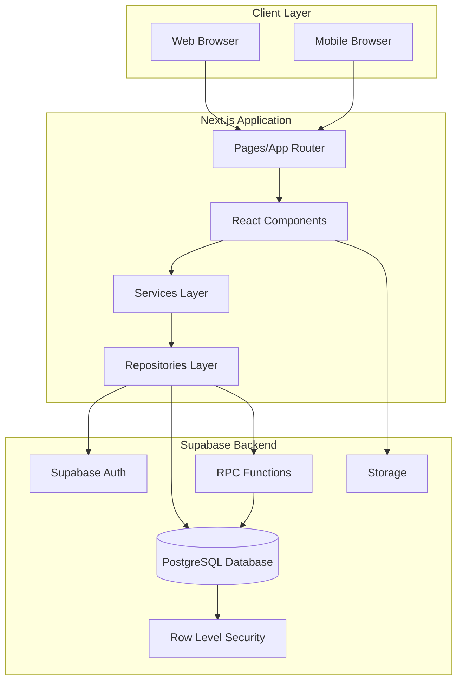

---

## Lagdelt Arkitektur

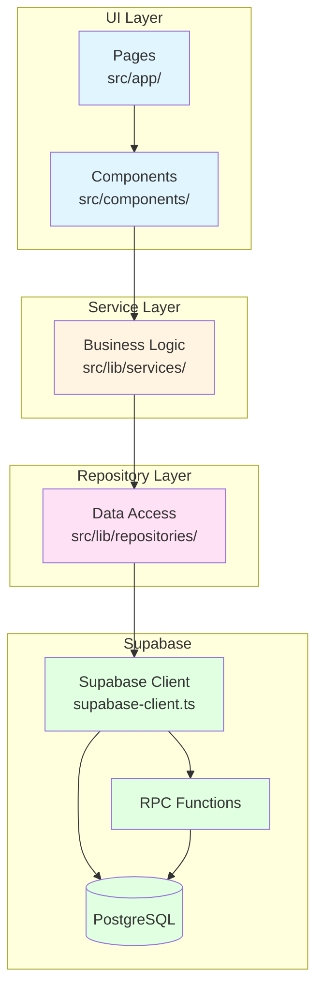

**Regel:** Data flyter alltid nedover (UI → Services → Repositories → Supabase). UI-komponenter skal **aldri** kalle Supabase direkte.

---

## Data Flow: Booking Creation

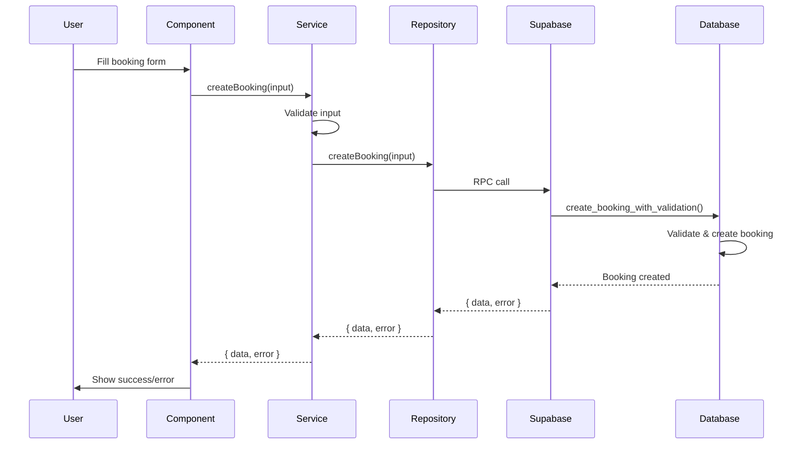

---

## Multi-Tenant Data Isolation

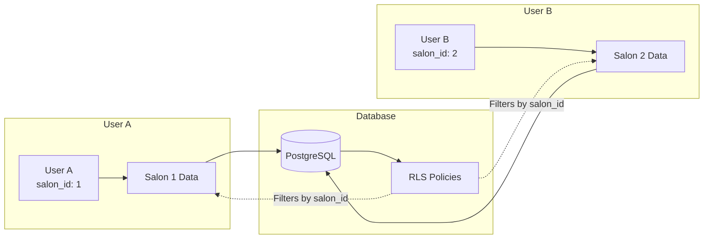

**RLS Policies sikrer:**
- User A kan kun se data for `salon_id = 1`
- User B kan kun se data for `salon_id = 2`
- Ingen data-lekkasje mellom salonger

---

## Authentication Flow

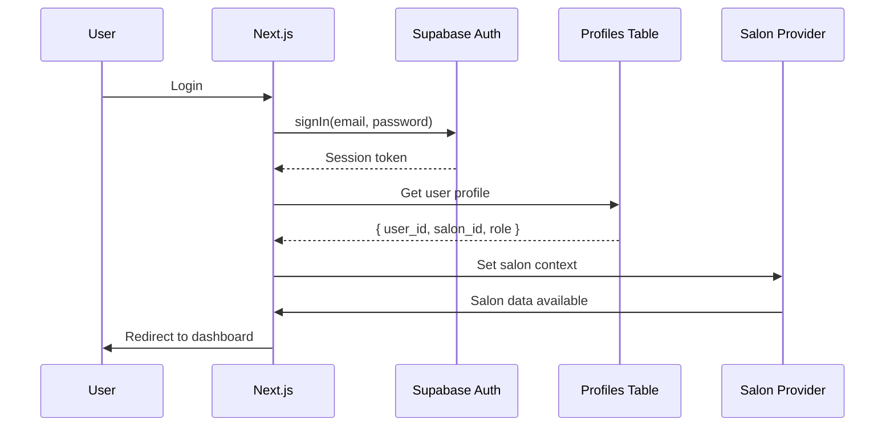

---

## Public Booking Flow

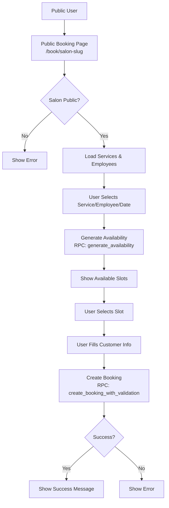

---

## Database Schema (Simplified)

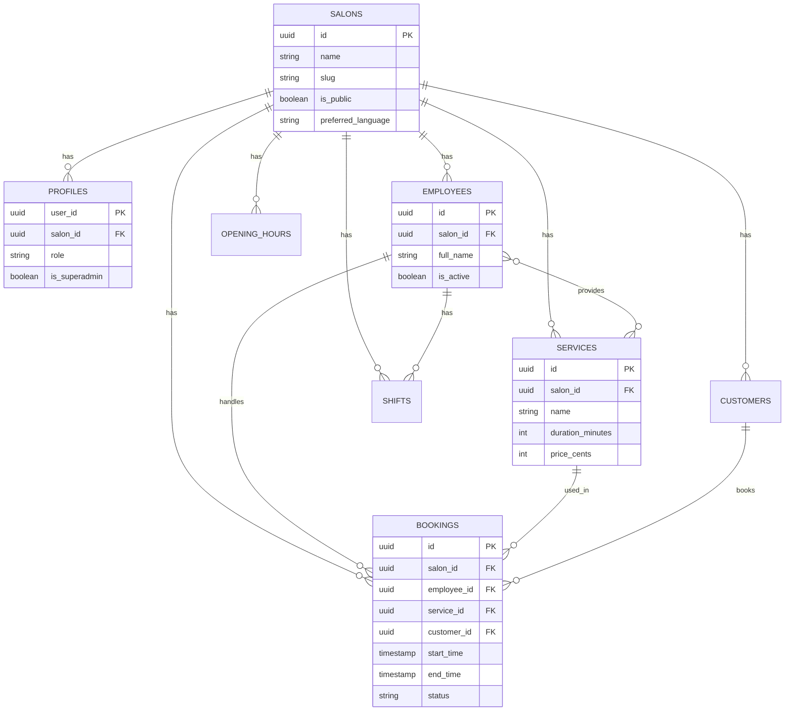

---

## Component Hierarchy

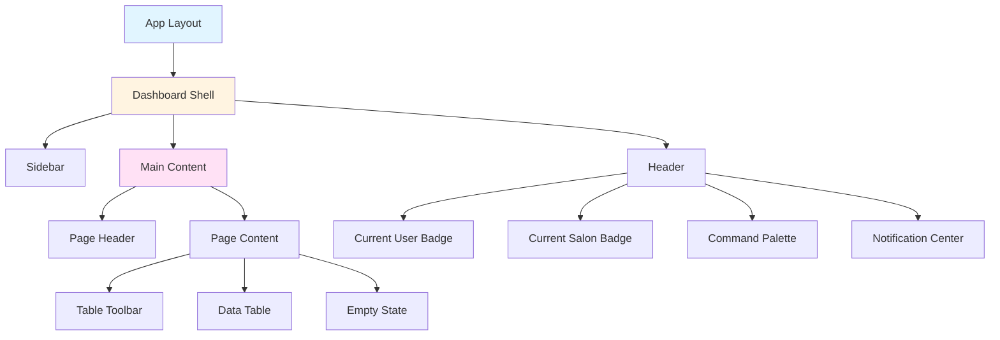

---

## Service Layer Pattern

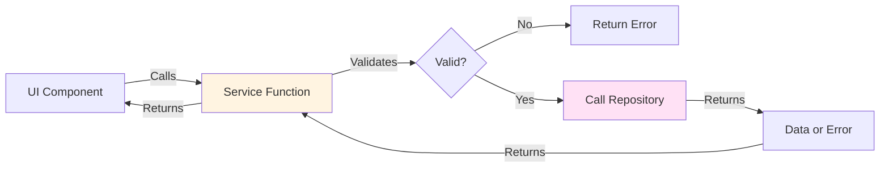

**Service Layer ansvar:**
- Validering av input
- Business logic
- Error-håndtering
- Orchestrering av repository-kall

---

## Repository Layer Pattern

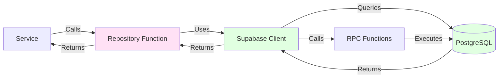

**Repository Layer ansvar:**
- Data access abstraksjon
- Supabase query-bygging
- Type-safe return values
- Error-håndtering

---

## Deployment Architecture

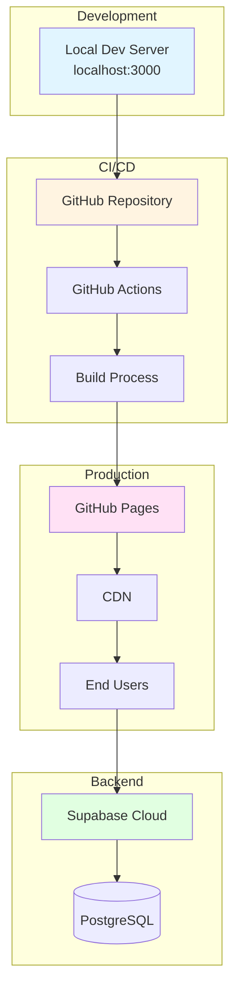

---

## Relaterte Dokumenter

- `docs/architecture/layers.md` - Detaljert lag-beskrivelse
- `docs/architecture/service-standards.md` - Service-standarder
- `docs/architecture/repository-standards.md` - Repository-standarder
- `docs/backend/supabase-foundation.md` - Supabase foundation
- `docs/features/public-booking.md` - Public booking flow

