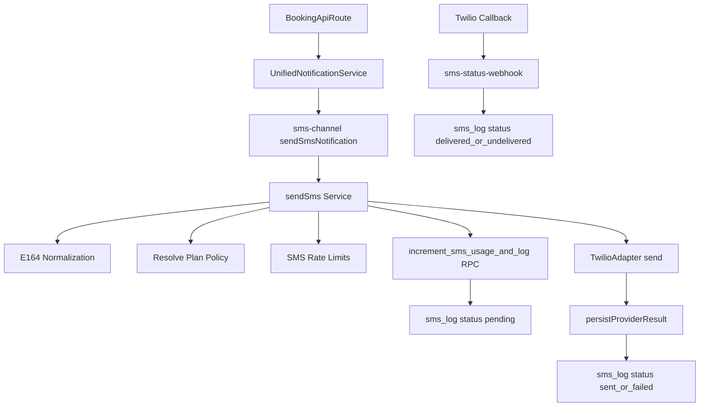

# SMS Architecture

This document is the source-of-truth for SMS in TeqBook.

Scope:
- Dashboard runtime send flow
- Supabase database objects for usage/logging
- Delivery status callbacks
- Overage preview (non-billing)

## Overview

TeqBook SMS is implemented as a plan-aware and usage-tracked flow:
- Message send is orchestrated by `sendSms` in [`apps/dashboard/src/lib/services/sms/service.ts`](../../apps/dashboard/src/lib/services/sms/service.ts).
- Provider integration is abstracted behind `SmsProvider` in [`apps/dashboard/src/lib/services/sms/types.ts`](../../apps/dashboard/src/lib/services/sms/types.ts), with Twilio implemented in [`apps/dashboard/src/lib/services/sms/twilio-adapter.ts`](../../apps/dashboard/src/lib/services/sms/twilio-adapter.ts).
- Usage and logs are persisted in `sms_usage` and `sms_log` via SQL/RPC in [`supabase/supabase/migrations/20260227000001_create_sms_usage_and_log.sql`](../../supabase/supabase/migrations/20260227000001_create_sms_usage_and_log.sql).
- Provider status updates are handled by Edge Function [`supabase/supabase/functions/sms-status-webhook/index.ts`](../../supabase/supabase/functions/sms-status-webhook/index.ts).
- Overage reporting preview is handled by Edge Function [`supabase/supabase/functions/billing-sms-overage-preview/index.ts`](../../supabase/supabase/functions/billing-sms-overage-preview/index.ts).

## End-to-End Send Flow

Key behavior:
1. Normalize recipient to E.164 (`normalizeToE164`).
2. Resolve plan policy (`resolveSmsPolicyForSalon`) including `SMS_NOTIFICATIONS` limits.
3. Enforce channel abuse controls (`claim-sms`, `manual-sms`, `sms-global-abuse`).
4. Reserve usage and create `sms_log` row via atomic RPC (`increment_sms_usage_and_log`).
5. Send through provider adapter (`TwilioAdapter`).
6. Persist provider result (`sent`/`failed`) and latency metadata.
7. Update delivery state later via webhook (`delivered`/`undelivered`).

## Data Model and RPCs

Implemented in migration:
- [`supabase/supabase/migrations/20260227000001_create_sms_usage_and_log.sql`](../../supabase/supabase/migrations/20260227000001_create_sms_usage_and_log.sql)

Primary tables:
- `sms_usage`
  - Tracks per-salon usage for a billing period (`period_start`, `period_end`)
  - Stores included quota, hard cap, used count, overage count, and overage estimate
- `sms_log`
  - Stores each message event with status, type, recipient, idempotency key, pricing, metadata, provider fields

RPCs:
- `ensure_sms_usage_row_for_period`
  - Creates/returns usage row for a billing window
- `increment_sms_usage_and_log`
  - Atomic usage increment + `sms_log` creation (`pending`)
  - Applies quota/cap guard and returns blocked/allowed outcome

Status update RPC:
- `update_sms_log_provider_result` in
  [`supabase/supabase/migrations/20260228000001_add_sms_log_status_update_rpc.sql`](../../supabase/supabase/migrations/20260228000001_add_sms_log_status_update_rpc.sql)

Note:
- Current dashboard implementation persists provider result using service-role admin client update in [`apps/dashboard/src/lib/services/sms/service.ts`](../../apps/dashboard/src/lib/services/sms/service.ts). The status RPC remains available for controlled DB-side updates.

## Provider Layer

Interfaces and types:
- [`apps/dashboard/src/lib/services/sms/types.ts`](../../apps/dashboard/src/lib/services/sms/types.ts)

Current provider:
- Twilio adapter in [`apps/dashboard/src/lib/services/sms/twilio-adapter.ts`](../../apps/dashboard/src/lib/services/sms/twilio-adapter.ts)
- Selected by `SMS_PROVIDER` (`twilio` default) in [`apps/dashboard/src/lib/services/sms/service.ts`](../../apps/dashboard/src/lib/services/sms/service.ts)

Current Twilio runtime vars:
- `TWILIO_ACCOUNT_SID`
- `TWILIO_AUTH_TOKEN`
- `TWILIO_FROM_NUMBER`

## Delivery Status Webhook

Edge Function:
- [`supabase/supabase/functions/sms-status-webhook/index.ts`](../../supabase/supabase/functions/sms-status-webhook/index.ts)

Behavior:
- `verify_jwt = false` in [`supabase/config.toml`](../../supabase/config.toml)
- Accepts Twilio callback form payload (`MessageSid`, `MessageStatus`, optional `ErrorCode`)
- Maps provider status to internal status and updates `sms_log`
- Uses service role to update `sms_log` by `provider_message_id`

Current authorization model:
- Checks `x-twilio-signature` header against `TWILIO_STATUS_WEBHOOK_TOKEN` shared secret.

## Overage Preview (No Charging Yet)

Edge Function:
- [`supabase/supabase/functions/billing-sms-overage-preview/index.ts`](../../supabase/supabase/functions/billing-sms-overage-preview/index.ts)

Behavior:
- Requires `Authorization: Bearer <SMS_OVERAGE_PREVIEW_TOKEN>`
- Reads `sms_usage` rows where `overage_count > 0`
- Returns preview payload for potential invoice-item generation
- Does not create Stripe invoice items (preview mode only)

## Rate Limiting and Abuse Controls

Policies are defined in both:
- [`packages/shared-core/src/rate-limit/policy.ts`](../../packages/shared-core/src/rate-limit/policy.ts)
- [`supabase/supabase/functions/_shared/rate-limit-config.ts`](../../supabase/supabase/functions/_shared/rate-limit-config.ts)

SMS-specific policies:
- `claim-sms`: 1 attempt / 5 minutes (fail-closed)
- `manual-sms`: 5 attempts / minute (fail-closed)
- `sms-global-abuse`: 1000 attempts / minute (fail-closed)

## Environment and Secrets

Dashboard app runtime:
- `SMS_PROVIDER`
- `TWILIO_ACCOUNT_SID`
- `TWILIO_AUTH_TOKEN`
- `TWILIO_FROM_NUMBER`
- `SUPABASE_SERVICE_ROLE_KEY` (required by admin update path in SMS service)

Supabase Edge Function secrets:
- `SUPABASE_URL`
- `SUPABASE_SERVICE_ROLE_KEY`
- `TWILIO_STATUS_WEBHOOK_TOKEN`
- `SMS_OVERAGE_PREVIEW_TOKEN`

See:
- [`docs/env/environment-variables.md`](../env/environment-variables.md)
- [`docs/env/env-setup.md`](../env/env-setup.md)
